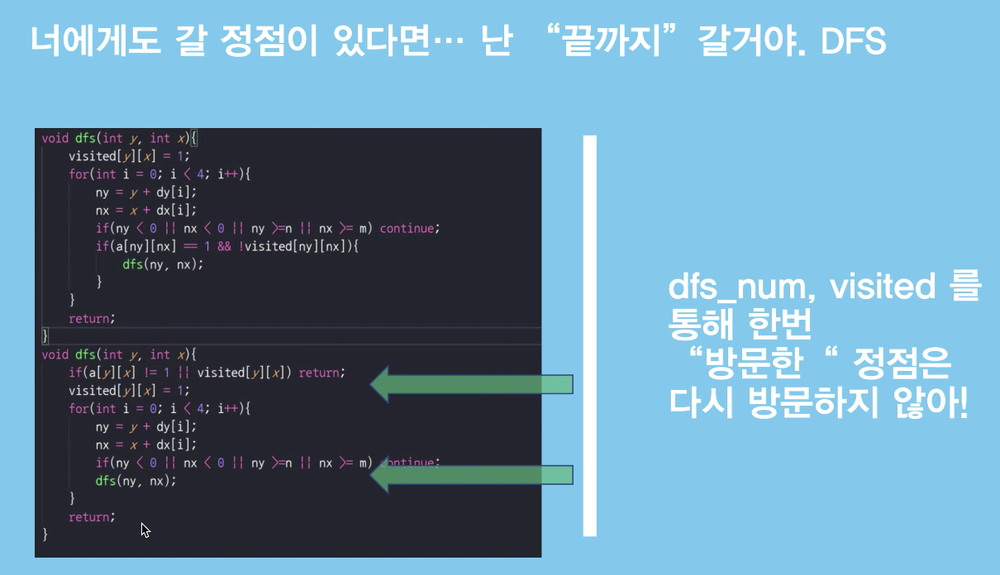

# Alogrithm

## 트리 : 부모,자식 계층적인 구조

V - 1 = E

임의의 두 노드 사이의 경로는 "유일무이"하며 "존재한다.

BST : Binary Search Tree  왼쪽 자식노드는 작게 오른쪽 자식노드는 크게 설정을 해서 노드를 집어넣고 뭔가를 찾거나 할때 빠르게 찾는다.

DAG: 사이클이 없고 단방향적인 그래프이다.

Connected Component : 연결된 집합단위로 찾는다. (여기서 커넥티드 컴포넌트는 2개다.)

4방향을 체크해야하고

돌다리 체크
위에 코드는 방문체크를 한것

돌다리 체크 X
아래는 바로 DFS를 돌리고 그다음 체크된는지 검사하는 것

유기농 배추 먼저 풀어보기

[참고] https://www.youtube.com/watch?v=zIOxaXgCGaw
