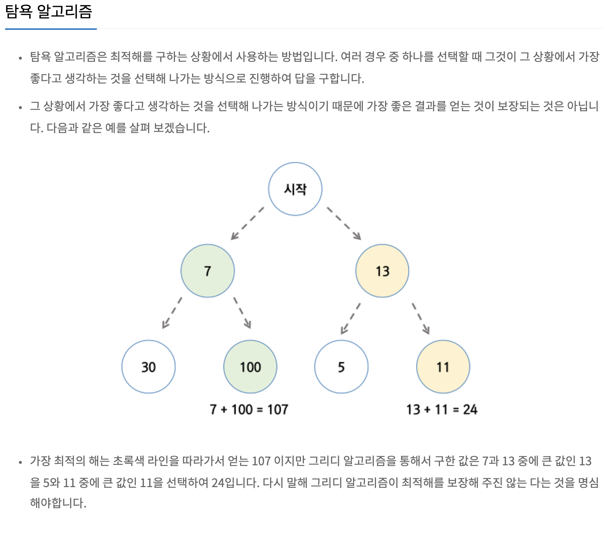

# Alogrithm

## Greedy : 탐욕알고리즘

그리디 알고리즘은 동적 프로그래밍 사용 시 지나치게 많은 일을 한다는 것에서 착안하여 고안된 알고리즘입니다. 동적 프로그래밍을 대체하는 것은 아니고 같이 쓰이며 서로 보완하는 개념입니다.
그리디 알고리즘은 탐욕 알고리즘 또는 욕심쟁이 알고리즘이라고도 불리는데요. 미래를 생각하지 않고 각 단계에서 가장 최선의 선택을 하는 기법입니다. 이렇게 각 단계에서 최선의 선택을 한 것이 전체적으로도 최선이길 바라는 알고리즘이죠.

물론 모든 경우에서 그리디 알고리즘이 통하지는 않습니다. 쉬운 예를 들자면 지금 선택하면 1개의 마시멜로를 받고, 1분 기다렸다 선택하면 2개의 마시멜로를 받는 문제에서는, 그리디 알고리즘을 사용하면 항상 마시멜로를 1개밖에 받지 못합니다. 지금 당장 최선의 선택은 마시멜로 1개를 받는 거지만, 결과적으로는 1분 기다렸다가 2개 받는 게 최선이기 때문이죠.

음 대표적으로는 거스름돈 계산해주는 것이 있는데 저는 거스름돈으로는 솔직히 납득이 안갔다... 
그래서 백준 로프문제(https://www.acmicpc.net/problem/2217)와 센서 문제(https://www.acmicpc.net/problem/2212)를 풀면서 느낀점인데 
항상 최적해가 아니라는 말을 잘 풀어보면 어차피 지금이 최적해일수도 있는데 뒤에 끝까지 다봐야된다는 말이다... 

concept
탐욕 알고리즘이란 매순간 최적이라고 생각되는 것을 선택해 나가는 방식으로 진행하여 최종적인 최적해에 도달하는 기법을 가리킵니다. 탐욕 알고리즘이 잘 작동하는 문제는 greedy choice property와 optimal substructure 두 가지 속성을 만족합니다. 전자의 경우 앞의 선택이 이후 선택에 영향을 주지 않는다는 걸 의미하고, 후자는 문제 전체에 대한 최적해(global optimum)가 부분문제에 대해서도 역시 최적해가 된다는 걸 뜻합니다

예제 코드는 거스름돈말고 로프문제로 올렸다.

[참고] 제로초 (https://www.zerocho.com/category/Algorithm/post/584ba5c9580277001862f188)

